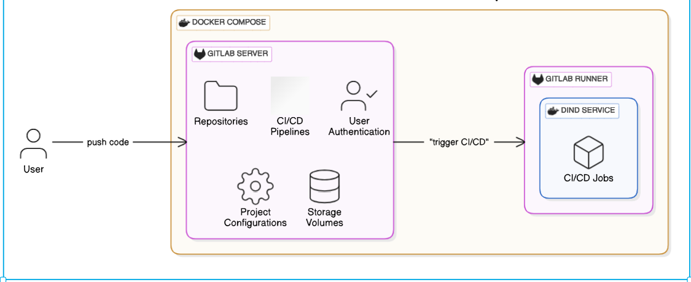

# Setting Up a Self-Hosted GitLab with a Runner and CI/CD Pipeline

This guide will walk you through setting up a **self-hosted GitLab instance** using Docker Compose, configuring a **GitLab Runner**, and setting up a **CI/CD pipeline**. By the end of this guide, you’ll have a fully functional GitLab environment with automated pipelines.

## 🖼️ Architecture Diagram
- **GitLab Server**: Hosted in a Docker container.
- **GitLab Runner**: Configured as a separate Docker container with Docker-in-Docker (DinD).
- **Network Communication**: How the GitLab Runner communicates with the GitLab Server.
- **Persistent Storage**: Volumes used for GitLab data and configurations.
- **External Dependencies**: SSH access and CI/CD pipeline execution.

<p align="center">  </p>

---

## 📋 Table of Contents
1. [GitLab Account & UI Exploration](#1-gitlab-account--ui-exploration)  
2. [Set Up a Self-Hosted GitLab Instance](#2-set-up-a-self-hosted-gitlab-instance)  
3. [Create and Configure a GitLab Runner](#3-create-and-configure-a-gitlab-runner)  
4. [Configure CI/CD Pipeline in a Project](#4-configure-cicd-pipeline-in-a-project)  
5. [Update GitLab Runner Configuration](#5-update-gitlab-runner-configuration)  
6. [Verify Everything Works](#6-verify-everything-works)  

---

## 1. GitLab Account & UI Exploration
Before diving into the self-hosted setup, familiarize yourself with GitLab:
- Create a **GitLab account** at [GitLab.com](https://gitlab.com/).
- Explore the GitLab UI:
  - Create a new project.
  - Navigate through **Repositories, CI/CD, Issues, and Settings**.
  - Understand GitLab’s features like repositories, pipelines, and runners.

---

## 2. Set Up a Self-Hosted GitLab Instance

### Step 1: Install Docker & Docker Compose
Ensure Docker and Docker Compose are installed on your machine:
```sh
sudo apt update && sudo apt install docker.io docker-compose -y
```

### Step 2: Create a `docker-compose.yml` File
Create a `docker-compose.yml` file to define the GitLab server:

```yaml
version: '3.8'

services:
  gitlab-server:
    image: 'gitlab/gitlab-ce:latest'
    container_name: gitlab-server
    environment:
      GITLAB_ROOT_EMAIL: "godcandidate101@gmail.com" # user email
      GITLAB_ROOT_PASSWORD: "Abcd@0123456789" # user pasword at least 12 chars
      GITLAB_OMNIBUS_CONFIG: |
        external_url 'http://localhost:8000'
        nginx['listen_port'] = 8000
        gitlab_rails['gitlab_shell_ssh_port'] = 2222
    ports:
      - '8000:8000'  # Web UI
      - '2222:22'     # SSH (Host 2222 → Container 22)
    volumes:
      - ./gitlab/config:/etc/gitlab
      - ./gitlab/data:/var/opt/gitlab
    networks:
      - gitlab-in-docker

networks:
  gitlab-in-docker:
    name: gitlab-in-docker
    driver: bridge
```

### Step 3: Start GitLab
Run the following command to start the GitLab container:
```sh
docker-compose up -d
```
Access GitLab at: **[http://localhost:8000](http://localhost:8000)**  
Login with the root credentials specified in the `docker-compose.yml`.


### Step 4: SSH Config
1. Generate a new ssh key

```sh

ssh-keygen -t rsa -b 4096 -C "your-email@example.com" -f ~/.ssh/id_rsa_gitlab
```

2. Copy the ssh key and add to Gitlab

```sh
cat ~/.ssh/id_rsa_gitlab
```
3. Add SSH Key to GitLab
- Go to GitLab.
- Click on your profile picture (top right) → Edit Profile.
- Navigate to SSH Keys (or go to https://gitlab.com/-/profile/keys).
- Paste your SSH key into the Key field.
- Click Add Key.
---

4. Configure ssh for gitlab
- first, get Gitlab server container ip
```sh
docker inspect -f '{{range.NetworkSettings.Networks}}{{.IPAddress}}{{end}}' gitlab-server
```
example gitlabIP : 192.168.1.100 #

-  configure ssh for gitlab
    nano ~/.ssh/config
```sh
Host gitlab-server
  HostName localhost  # Replace with gitlabIP
  User git
  Port 2222
  IdentityFile ~/..ssh/id_rsa_gitlab
  IdentitiesOnly yes

```

## 3. Create and Configure a GitLab Runner

### Step 1: Deploy GitLab Runner
Add the GitLab Runner service to your `docker-compose.yml`:

```yaml
  gitlab-runner:
    image: gitlab/gitlab-runner:alpine
    container_name: gitlab-runner
    network_mode: 'network_mode'   # a separate network for docker server and dnd to communicate
    volumes:
      - /var/run/docker.sock:/var/run/docker.sock
```

Restart your setup:
```sh
docker-compose up -d
```

### Step 2: Register GitLab Runner
1. Add a runner in your project
- Go to your project settings and select CI/CD
- Select Runner and choose New project runner
- Give tag name( this will be used as a reference in your pipeline) and a description
- Create the runner and copy the command from `STEP 1` in Gitlab UI

example 
```sh
gitlab-runner register  --url http://localhost:8000  --token glrt-t3_snZzntHFpN7Uki1G7gcc
```

2. Register your runner (we will use docker-in-docker executor)
- Enter the gitlab-runner container
```sh
docker compose exec -it gitlab-runner /bin/bash
```
- Register your runner with the codes you copied from `STEP 1`, add docker privilege and docker volumes tag

```
gitlab-runner register  --url http://localhost:8000  --token glrt-t3_snZzntHFpN7Uki1G7gcc
--docker-privileged --docker-volumes "/certs/client"
```

- Follw the next prompts to register 
```
  name of runner: docker-in-docker(same as gitlab GUI runner name)
  default image: docker:28.0.2 (any image of your choice)
```

- Verify the runner is active in GitLab UI under `Settings > CI/CD > Runners`.

---

## 4. Configure CI/CD Pipeline in a Project

### Step 1: Create a `.gitlab-ci.yml` File
Inside your project, create a `.gitlab-ci.yml` file to define the pipeline:


Ref [Gitlab CI](./assets/gitlab-ci.yml)

### Step 2: Push Changes & Trigger the Pipeline
Commit and push your changes:
```sh
git add .
git commit -m "Add CI/CD pipeline"
git push origin main
```
Check the GitLab UI under `CI/CD > Pipelines` to see the pipeline running.

---

## 5. Update GitLab Runner Configuration

Edit the **GitLab Runner config file** (`config.toml`) to ensure proper communication:
Change the network mode and a clone_url
```sh
docker compose exec -it gitlab-runner /bin/bash

nano /etc/gitlab-runner/config.toml

```
Add `clone_url` and update network settings `network_mode`:
```toml
...
[[runners]]
  name = "Docker in Docker Runner"
...
    clone_url = "http://gitlab-server:8000" # gitlab-server replace with name of gitlab server container
...
  [runners.docker]
...
    network_mode = "gitlab-in-docker" # your bridge network
...

```
Restart the GitLab Runner:
```sh
docker restart gitlab-runner
```

---

## 6. Verify Everything Works
- Access GitLab UI: **[http://localhost:8000](http://localhost:8000)**
- Check CI/CD Pipeline: `CI/CD > Pipelines`
- Verify GitLab Runner: `Settings > CI/CD > Runners`
- Test SSH Access, clone any repo in your gitlab:
```sh
git clone ssh://git@localhost:2222/root/my-project.git
```

---

